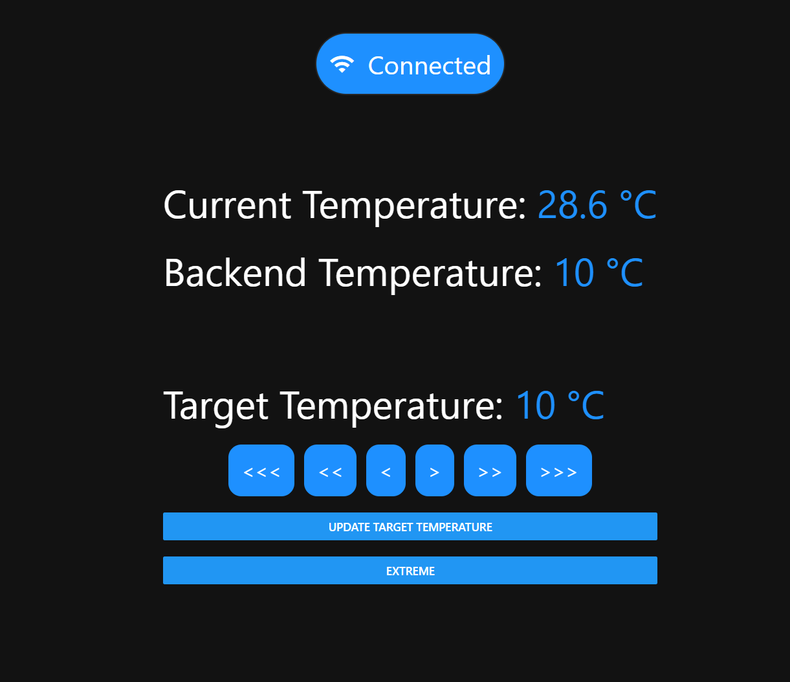
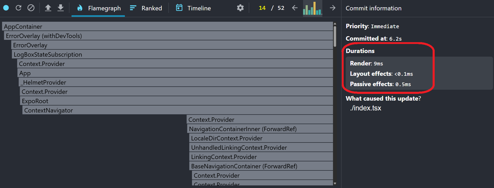

# react-native-thermostats-task

## 1) Links:

- Deployment: https://react-native-thermostats-task-346936176354.europe-west1.run.app/
- YouTube: https://www.youtube.com/watch?v=VcSdHV8YYJA

## 2) Media:

## 3) Question 1 (The task):

- Displaying current temperature ✅
- Displaying target Temperature ✅
- +/- steppers ✅
- Offline mode toggle ✅
- Using Redux ✅

## 4) Question 2 (Performance):

- `Profiling`: As we can see, on profiling the app,
  - `Maximum` rendering time only took `9ms`
  - `Average` rendering time only took `1.5ms`
- This is so perfect. This means that the app runs smoothly with no performance issues
- `React Compiler` is active: we are using the latest version of Expo, which includes the latest version of React

- Mock API (Using RTKQuery) ✅
- Random latency: (from 0 ms to 2500 ms random latency) ✅
- out-of-order safety: older responses must not overwrite newer intent (no UI regression) ✅
  - Automatically implemented by RTKQuery
- `occasional failure`: failure rate is 25%
- flush on reconnect: when Offline mode is turned off, automatically attempt to flush the queued command(s) ✅
- Race Condition ✅
- if a send fails, keep it queued and show an error; include a simple “Retry now” control ✅
- Decisions ✅👇

## 5) Decisions:

- Using `RTKQuery` (The new Redux): because it automatically handles the race condition. And it's the industry standard when communicating with APIs
- CronJob, in the `_layout` file, I created a cron job to keep updating the temperature even when we are disconnected

## 5) No AI Usage, Just Pure Software Engineering:

- No AI was used here (Except in creating the Docker File)
- Everything here is written by me
- Pure Software Engineering, no AI
- I can explain every line of this code, because I wrote it myself (Except the Dockerfile, that's the only thing I can't explain 😂)

## 6) Extra:

- Added CI/CD to GGogle Cloud
- AsyncStorage
- CronJob
